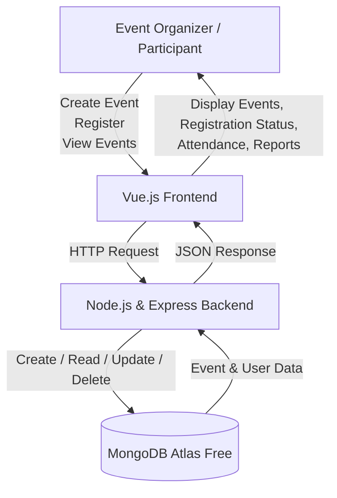

# System Architectural Design
## 1. System Overview
The Event Management System is a web-based application that helps organizers efficiently manage events, participant registrations, attendance, and event-related information. Its primary purpose is to simplify the event management process by providing a centralized platform for organizing and monitoring events.
## 2. Selected Architectural Pattern
The proposed system will use a three-tier client-server architecture.
The system will be divided into:
1. Presentation layer
2. Application layer
3. Data layer
This architecture separates the user interface, business logic, and data
management responsibilities.
## 3. Architectural Components
### Presentation Layer
The presentation layer will use Vue.js. It will display information,
collect user input, and send requests to the backend.

responsibilities:
- Display user interface
- Collect user input
- Send HTTP requests
- Display system responses
### Application Layer
The application layer will use Node.js and Express. It will receive
requests, validate data, apply system rules, and communicate with the
database.

responsibilities:
- Process requests
- Validate data
- Apply business rules
- Communicate with the database
### Data Layer
The data layer will use MongoDB Atlas Free. It will store, retrieve,
update, and delete the system's records.

responsibilities:
- Store data
- Retrieve data
- Update data
- Delete data
## 4. Component Responsibilities
| Component | Technology | Responsibility |
|---|---|---|
| User interface | Vue.js | Displays data and collects user input |
| Application server | Node.js and Express | Processes requests and applies business rules |
| Database | MongoDB Atlas Free | Stores and manages system records |
| Repository | GitHub | Stores documentation and tracks changes |
## 5. System Architecture Diagram

## 6. Data Flow
### Example Process: Register for an Event
1. The user selects an event and fills out the registration form through the Vue.js interface.
2. Vue.js validates the required input fields.
3. The frontend sends an HTTP request to the Node.js and Express backend.
4. The backend validates the submitted information and applies the system's business rules.
5. The backend stores the registration details in MongoDB Atlas Free.
6. MongoDB Atlas Free returns the operation result to the backend.
7. The backend sends a JSON response to the frontend.
8. The frontend displays a confirmation message and updates the user's registration status.